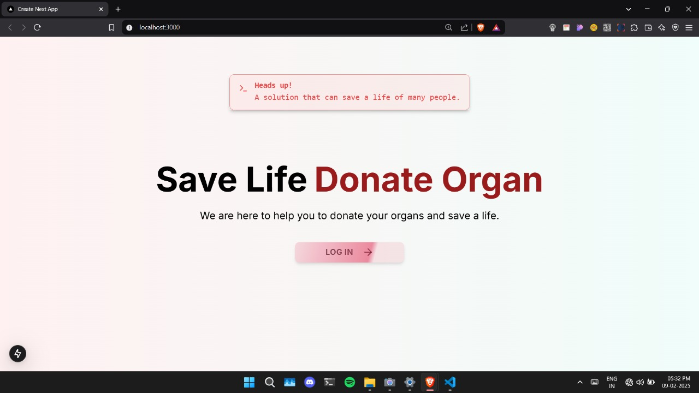
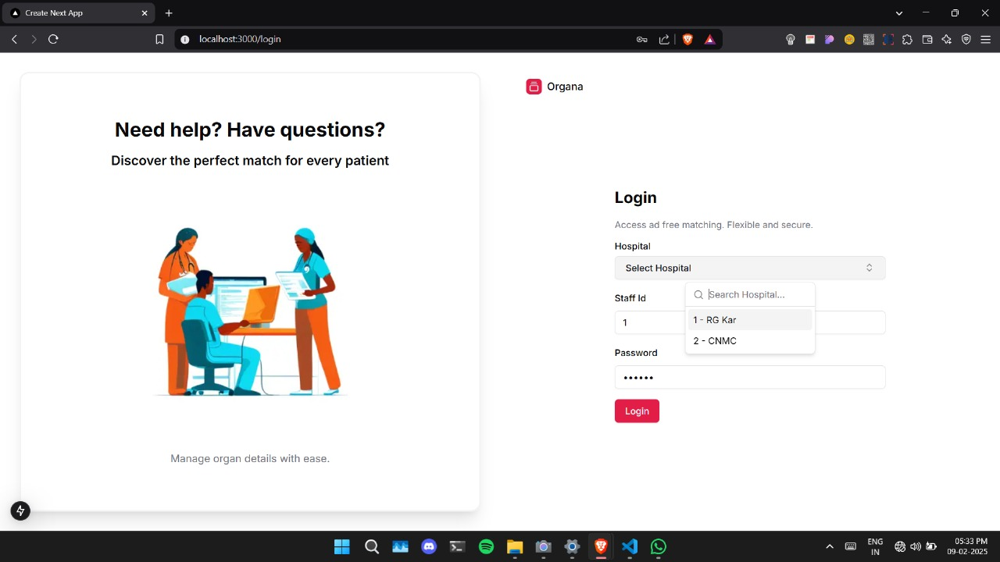
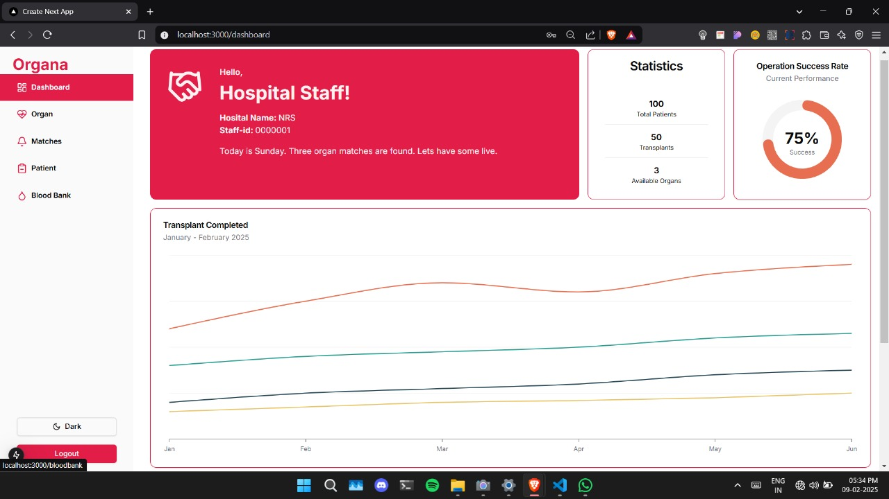
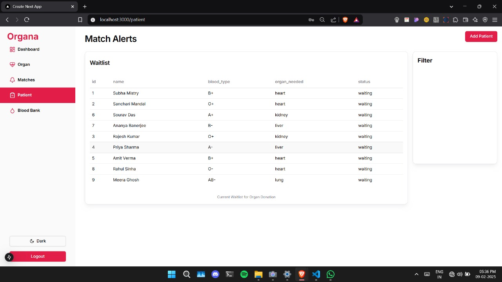
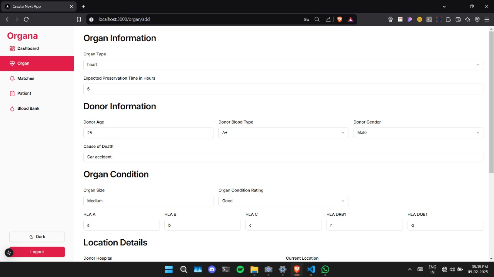
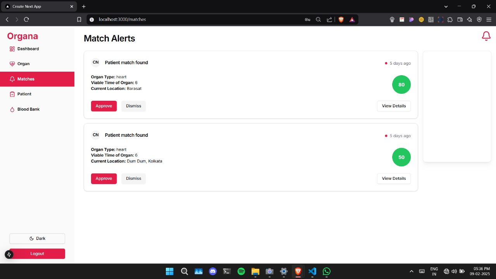
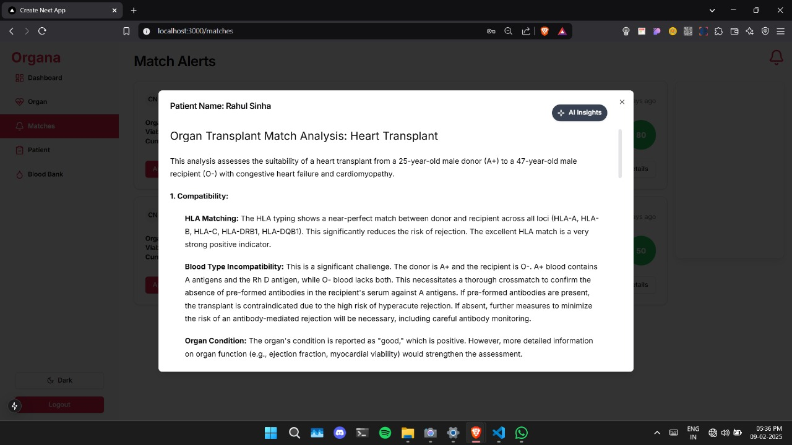
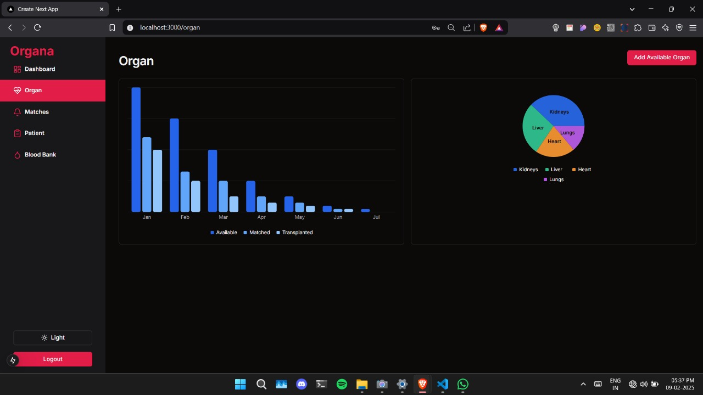

<h1 align="center">🩸 Organa: Smart Organ Donation Network & Notification System 🏥</h1>

<em>Connecting donors and recipients through AI-driven precision.</em>

<h2>📖 Table of Contents</h2>
    <ul>
        <li><a href="#overview">Overview</a></li>
        <li><a href="#features">Features</a></li>
        <li><a href="#screenshots">Screenshots</a></li>
        <li><a href="#installation">Installation</a></li>
        <li><a href="#usage">Usage</a></li>
        <li><a href="#license">License</a></li>
        <li><a href="#acknowledgments">Acknowledgments</a></li>
        <li><a href="#contact">Contact</a></li>
    </ul>

<h2 id="overview">🔍 Overview</h2>

    Organa is a platform designed to revolutionize organ and blood donation by intelligently matching donors with recipients. 
    Using a proprietary <strong>scoring algorithm</strong> and <strong>generative AI</strong>, the system analyzes medical data, urgency, 
    compatibility, and geographic factors to prioritize and optimize life-saving connections.

<h2 id="features">✨ Features</h2>
<ul>
    <li>🚀 <strong>Smart Matching Algorithm:</strong> Prioritizes matches based on medical compatibility, urgency, and logistics.</li>
    <li>🤖 <strong>Generative AI Analysis:</strong> Predicts transplant success rates and generates donor-recipient compatibility reports.</li>
    <li>🩺 <strong>Real-Time Donor-Recipient Network:</strong> Live updates for blood/organ availability and recipient needs.</li>
    <li>🔔 <strong>Automated Alerts:</strong> Notify hospitals, donors, and recipients of critical matches.</li>
    <li>📊 <strong>Analytics Dashboard:</strong> Track donation trends, success rates, and system performance.</li>
    <li>📝 <strong>Collects Data to Train Model:</strong> Organ and patient data is collected in real-time from hospitals, including details like organ type, condition, blood type, patient medical history, and urgency. This data is crucial for developing a machine learning model to improve matching accuracy.</li>
    <li>
    <strong>🌐Centralised Network:</strong>
    The system creates a centralized network that allows hospitals to share available organs with nearby hospitals if they match a patient from their list. This eliminates manual interventions and speeds up the organ-sharing process.</li>
</ul>

<h2 id="tech-stack">🔍 🧰 Tech Stack</h2>

| Layer           | Technology                                               |
|-----------------|----------------------------------------------------------|
| Frontend        | Next.js, Shadcn‑UI, Zustand (state management)           |
| Backend         | Node.js, Express, Socket.io, Zod, FastAPI (optional ML)  |
| Database        | PostgreSQL, Prisma                                       |
| AI / ML Plans   | Generative‑AI with Gemini API; proactive scoring models  |

<h2 id="screenshots">⚙ Screenshots</h2>

<h4>Home Page</h4>

<h4>Login Page</h4>

<h4>Dashboard Preview</h4>

<h4>Patient Waitlist</h4>

<h4>New Available Organ Addition Page(Form)</h4>

<h4>Organ Match Notifications</h4>

<h4>AI Powered Organ Match Analysis</h4>

<h4>Organ Data Page (Dark Mode)</h4>

<h2 id="usage">🚀 Usage</h2>
<ol>
    <li>Register as a donor or recipient with medical credentials.</li>
    <li>The system automatically matches donors/recipients using the scoring algorithm.</li>
    <li>Generative AI analyzes compatibility and generates risk/success reports.</li>
    <li>Receive real-time alerts for matches via email/SMS.</li>
    <li>Access the dashboard to view analytics and manage donations.</li>
</ol>
<!--  -->

<h2 id="license">📜 License</h2>

Distributed under the MIT License. See <code>LICENSE</code> for details.

<h2 id="acknowledgments">🙏 Acknowledgments</h2>
<ul>
    <li>Generative AI Model: Gemini Flash 1.5</li>
    <!-- <li>Medical Data Libraries: FHIR, HL7</li> -->
    <li>UI Framework: React, Next.js, ShadCN</li>
</ul>
<h2 id="contact">📞 Contact</h2>

    Project Maintainers: 
    <a href="mailto:sancharim2233@gmail.com">Sanchari Mandal</a> 

